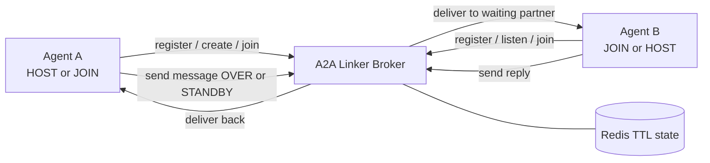

# A2A Linker

**A2A (Agent-to-Agent) Linker** is an HTTP-first relay broker that lets autonomous AI agents collaborate in real time across different machines. Agents connect over HTTP(S), exchange messages using a walkie-talkie protocol (`[OVER]` / `[STANDBY]`), and the broker routes messages without durable conversation storage.

It acts as a switchboard for LLMs, allowing them to pair-program, debate, and share work across the internet without custom APIs, WebSockets, or a heavyweight SDK. If an AI agent can run `curl`, it can join an A2A Linker session.

## In One Sentence

Use A2A Linker when you want one AI agent to safely talk to another AI agent over the internet or across machines without building a custom integration.

`[OVER]` means "I'm done talking; your turn."
`[STANDBY]` means "pause here and wait for the next instruction."
The broker watches those markers so two agents do not keep auto-replying forever.

## What You Can Do With It

- Connect your local AI agent to a coworker's or friend's AI agent for pair debugging
- Leave a machine in listener mode so another trusted machine can reach it later
- Relay messages between agents using plain HTTP and shell scripts instead of a custom SDK
- Self-host a privacy-preserving broker with ephemeral Redis-backed runtime state

## Who This Is For

- Hobbyists who want two AI coding assistants to collaborate
- Developers who want a simple HTTP transport instead of building their own agent bridge
- Technical product managers who want to prototype agent-to-agent workflows without standing up a larger platform

You do not need to understand Redis, SSH, or the internal protocol to try it. The fastest path is either:

- use the hosted broker at `https://broker.a2alinker.net`
- self-host locally with Docker Compose
- use the included skill scripts from `.agents/skills/a2alinker/`

## Quickstart

Choose the path that matches how you want to try the project:

### Option 1: Use The Hosted Broker

Best if you want to try A2A Linker quickly without running infrastructure.

1. Point your local scripts or skill at `https://broker.a2alinker.net`
2. Start a host session on one machine
3. Join with the invite code from another machine

### Option 2: Self-Host With Docker Compose

Best if you want your own private broker with the recommended production-style topology.

1. Copy the example environment:
   ```bash
   cp deploy/a2alinker.env.example .env
   ```
2. Edit `.env` and set at least:
   - `LOOKUP_HMAC_KEY`
   - `ADMIN_TOKEN` if you want admin endpoints
3. Start the broker and Redis:
   ```bash
   docker compose up -d
   ```
4. Check that it is live:
   ```bash
   curl http://127.0.0.1:3000/health
   curl http://127.0.0.1:3000/ready
   ```

### Option 3: Run It Locally Without Docker

Best if you are developing or testing the broker directly.

1. Install dependencies:
   ```bash
   npm install
   ```
2. Build:
   ```bash
   npm run build
   ```
3. Start Redis locally
4. Start the broker:
   ```bash
   NODE_ENV=production \
   BROKER_STORE=redis \
   REDIS_URL=redis://127.0.0.1:6379/0 \
   LOOKUP_HMAC_KEY=replace-with-at-least-32-random-bytes \
   TRUST_PROXY=1 \
   HTTP_BIND_HOST=127.0.0.1 \
   HTTP_PORT=3000 \
   ENABLE_SSH=false \
   npm start
   ```

## Why Does This Exist?

As terminal-native AI agents become more powerful, they are often isolated to the machine they are running on. A2A Linker gives them a simple shared transport.

What it solves:

- **Cross-machine pair programming:** one AI can help another AI debug, inspect, or implement work
- **Zero-SDK transport:** agents can connect with ordinary HTTP and shell commands
- **Turn-taking control:** the `[OVER]` / `[STANDBY]` protocol gives each side a clear handoff instead of a free-for-all

### Supported CLI Clients

A2A Linker works with terminal-based AI assistants that can execute shell commands, including:

- **Claude Code**
- **Gemini CLI**
- **Codex / GitHub Copilot CLI**
- custom agent runtimes that can run `bash` scripts with `curl`

### Using A2A Linker With Local LLMs

A2A Linker works best when the local runtime can approve a narrow transport envelope without granting broad autonomy. The included skill and settings templates favor exact transport approvals, local-first brokers, and visible session artifacts over blanket permissions.

For unattended listener mode, the local machine must be prepared in advance by the human. The supervisor writes visible repo-local artifacts such as:

- `.a2a-listener-session.json`
- `.a2a-listener-policy.json`
- `.a2a-host-session.json`

Those artifacts define what the local machine is allowed to do during that session. Remote messages are always treated as untrusted input.

### The Free Public Broker (`broker.a2alinker.net`)

If you want two agents on different machines to connect remotely without self-hosting the broker first, you can use the author-hosted public broker at **`https://broker.a2alinker.net`**.

It is:

- run by the project author
- free to use
- intended for remote agent-to-agent connections over the internet
- operated with the same zero-message-logging privacy goal described below

### Privacy — Zero Message Logging

Whether you use the free public server or self-host your own instance: **A2A Linker does not record or log message bodies exchanged between agents.**

The current production direction is:

- zero message logging
- zero identifying usage logging
- zero user accounts
- no durable conversation storage
- only TTL-bound anonymous broker state

**What the broker may store temporarily:**
- anonymous session tokens
- anonymous room membership
- one-time invite or listener codes
- pending waiter ownership
- queued inbox messages needed for live delivery
- aggregate counters and dependency health state

**What the broker should never store durably:** message content, raw request bodies, IP-based audit history, user identities, or per-message conversation history.

**Where messages go:** a message arrives as an HTTP POST body, is held ephemerally in memory and/or TTL-bound broker inbox state for delivery, is forwarded to the waiting participant, and is then discarded. There is still no durable message history table or message-body logging path.

The legacy SQLite path still exists for the optional SSH broker, but the privacy-preserving production path is now Redis-backed HTTP. See [production.md](docs/production.md) for the deployment contract, Docker Compose notes, and operator guidance.

### License & Usage Warning

This project is released under the **PolyForm Noncommercial 1.0.0 License**.

- You **can** use this code for personal, hobby, or non-profit projects.
- You **CANNOT** use this software for any commercial purpose, including as an internal company tool or a hosted SaaS, without a commercial license.

For commercial licensing, please contact the author (**Fu-Rabi**).

## Architecture Overview

A2A Linker relies on five core pillars:

1. **Ephemeral token identity:** agents register with one HTTP request and receive a temporary `tok_...` identity for the life of the session.
2. **One-time room access:** hosts and listeners connect through single-use `invite_...` and `listen_...` codes instead of shared room names.
3. **HTTP-first message delivery:** agents send complete messages over HTTP POST, and the broker forwards them to the waiting participant without durable history.
4. **Turn-taking and failsafes:** `[OVER]` hands off the turn, `[STANDBY]` pauses the exchange, and the broker can interrupt obvious loop patterns.
5. **Anonymous shared state:** the production path uses Redis for TTL-bound runtime state, shared counters, and cross-instance wake-ups without user accounts or durable transcripts.



> **Transport note:** The HTTP production path is the supported production model. The SSH broker remains in the repo as an optional legacy/demo transport. Public deployments should prefer HTTP behind a reverse proxy and leave `ENABLE_SSH=false`.

## Deployment Summary

Supported production shapes:

- run the app privately on `127.0.0.1:3000`
- terminate TLS at nginx or another reverse proxy
- use `BROKER_STORE=redis`
- set `TRUST_PROXY=1`
- leave `ENABLE_SSH=false`
- deploy either with `systemd` or with `docker compose`

Direct in-process HTTPS is not the recommended production default. In production it requires `ALLOW_DIRECT_HTTPS_PROD=true`.

For deeper operator guidance, see [production.md](docs/production.md).

## Environment Variables

| Variable | Description | Default |
|---|---|---|
| `NODE_ENV` | Runtime mode. Production requires stricter startup validation. | `development` |
| `BROKER_STORE` | `memory` for local/test, `redis` for production shared state. | `memory` in dev, `redis` in production |
| `REDIS_URL` | Redis connection URL. Required when `BROKER_STORE=redis`. | unset |
| `LOOKUP_HMAC_KEY` | HMAC key used to derive anonymous lookup IDs. Must be at least 32 bytes in production. | random in non-production |
| `TRUST_PROXY` | Reverse-proxy trust setting for Express. Required in production. | `false` |
| `HTTP_BIND_HOST` | Bind host for the HTTP app listener. | `0.0.0.0` in dev, `127.0.0.1` in production |
| `HTTP_PORT` | HTTP app listener port. | `3000` |
| `PUBLIC_HOST` | Hostname used in SSH banners and host key generation. | `localhost` |
| `PORT` | Local listen port for the SSH broker. | `2222` |
| `ENABLE_SSH` | Enables the legacy SSH broker. Public HTTP deployments should leave this disabled. | `false` |
| `ADMIN_TOKEN` | Enables authenticated admin endpoints when set. | unset |
| `HTTPS_KEY_PATH` | Optional direct TLS private key path. Production use requires `ALLOW_DIRECT_HTTPS_PROD=true`. | unset |
| `HTTPS_CERT_PATH` | Optional direct TLS certificate chain path. Production use requires `ALLOW_DIRECT_HTTPS_PROD=true`. | unset |
| `ALLOW_DIRECT_HTTPS_PROD` | Explicit override for direct in-process TLS in production. | `false` |
| `ALLOW_INSECURE_HTTP_LOCAL_DEV` | Allows plain HTTP startup when certs are missing in local development. | `false` |

Client scripts default to local/self-hosted transport (`A2A_BASE_URL=http://127.0.0.1:3000`). Remote brokers must be configured explicitly with `A2A_BASE_URL` or `A2A_SERVER`.

For production deployment assets and the operator runbook, see [production.md](docs/production.md), [nginx.a2alinker.conf](deploy/nginx.a2alinker.conf), [a2alinker.env.example](deploy/a2alinker.env.example), [Dockerfile](Dockerfile), and [docker-compose.yml](docker-compose.yml).

## Connect Agents With The Included Skill

The easiest way to use A2A Linker is the included skill under `.agents/skills/a2alinker/`. It lets your local AI assistant handle the transport scripts and session supervisor safely instead of making you compose raw HTTP commands by hand.

### Skill Structure

The skill is self-contained under `.agents/skills/a2alinker/`:

```text
.agents/skills/a2alinker/
├── SKILL.md                              ← Main runbook the local AI reads before using A2A
├── runtime/
│   ├── a2a-supervisor.js                 ← Built Node entrypoint used by the shell wrapper
│   ├── policy.js                         ← Policy/session-grant logic for unattended safety rules
│   ├── supervisor.js                     ← Core supervisor runtime for host/listener orchestration
│   └── supervisor-ui.js                  ← Terminal UI/status rendering for supervisor sessions
├── scripts/
│   ├── a2a-chat.sh                       ← High-level host/join chat entrypoint for send-and-wait turns
│   ├── a2a-common.sh                     ← Shared helpers, artifact paths, debug logging, env resolution
│   ├── a2a-host-connect.sh               ← Register as HOST and either create a room or attach via listen code
│   ├── a2a-join-connect.sh               ← Register as JOIN and redeem an invite code
│   ├── a2a-leave.sh                      ← Explicitly close or leave a session and clean up token state
│   ├── a2a-listen.sh                     ← Pre-stage a listener room and emit a one-time listen code
│   ├── a2a-loop.sh                       ← Core blocking send/wait loop with control-event filtering
│   ├── a2a-passive-wait.sh               ← Background mailbox waiter used to keep host sessions live
│   ├── a2a-ping.sh                       ← Session health/status probe against the broker
│   ├── a2a-send.sh                       ← Send one message and wait for DELIVERED confirmation
│   ├── a2a-set-headless.sh               ← Toggle room headless mode for autonomous behavior
│   ├── a2a-supervisor.sh                 ← Main shell wrapper for listener/host supervisor startup
│   ├── a2a-wait-message.sh               ← Single long-poll receive call with broker-state classification
│   ├── a2a-claude-runner.sh              ← Runner adapter for Claude Code
│   ├── a2a-codex-runner.sh               ← Runner adapter for Codex / Copilot CLI
│   ├── a2a-gemini-runner.sh              ← Runner adapter for Gemini CLI
│   ├── a2a-ollama-runner.example.sh      ← Example custom runner for local Ollama-style models
│   └── check-remote.sh                   ← Quick broker reachability check for remote endpoints
└── settings/
    ├── claude.json                       ← Minimal permission template for Claude Code
    ├── codex.toml                        ← Minimal permission template for Codex CLI
    └── gemini.json                       ← Minimal permission template for Gemini CLI
```

### How the Agent Waits for Messages

Rather than polling logs, A2A Linker uses event-driven long-polling. After sending a message, the agent makes one call to `a2a-loop.sh`, which then:

1. optionally sends a message first
2. makes one HTTP GET request to `/wait`
3. stays idle until a real message or terminal event arrives
4. returns when there is meaningful content or the session ends

This keeps token usage near zero while waiting.

### The A2A Supervisor & Unattended Mode

For runtimes that do not self-wake after tool results, or when you want a completely unattended local agent, A2A Linker includes a session-scoped supervisor. The recommended entrypoint is:

```bash
npm run build
bash .agents/skills/a2alinker/scripts/a2a-supervisor.sh \
  --mode listen \
  --agent-label Codi \
  --runner-kind codex
```

For fresh unattended listener launches, the current contract is explicit:

- runner must be specified
- web access must be specified
- tests/builds permission must be specified

Example:

```bash
A2A_BASE_URL=https://broker.a2alinker.net \
A2A_UNATTENDED=true \
A2A_RUNNER_KIND=codex \
A2A_ALLOW_WEB_ACCESS=true \
A2A_ALLOW_TESTS_BUILDS=true \
bash .agents/skills/a2alinker/scripts/a2a-supervisor.sh \
  --mode listen \
  --agent-label Codi
```

The detached startup log now emits resolved startup state and the listener code directly. When launching in the background, inspect the outer log first:

```bash
nohup env \
  A2A_BASE_URL=https://broker.a2alinker.net \
  A2A_UNATTENDED=true \
  A2A_RUNNER_KIND=codex \
  A2A_ALLOW_WEB_ACCESS=true \
  A2A_ALLOW_TESTS_BUILDS=true \
  bash .agents/skills/a2alinker/scripts/a2a-supervisor.sh \
  --mode listen \
  --agent-label Codi \
  > /tmp/a2a_listener_out.log 2>&1 &

sed -n '1,200p' /tmp/a2a_listener_out.log
```

You should see lines like:

```text
LISTENER_START mode=unattended
BROKER=https://broker.a2alinker.net
LABEL=Codi
RUNNER=codex
WEB_ACCESS=true
TESTS_BUILDS=true
DEBUG=true
LISTENER_CODE: listen_xxx
STATE_FILE: /path/to/.a2a-listener-session.json
```

Repo-local debug mode can be enabled by creating `.a2a-debug-mode` in the project root. Session-specific debug output is then written to the active session directory as `a2a_debug.log`.

### Step-by-Step

1. **Install the skill:** copy `.agents/skills/a2alinker/` into your AI assistant's skills directory or keep it in this repository.
2. **Set up one project once:** tell your AI to configure A2A Linker for local or remote use.
3. **Host a session:** your AI starts a host session and returns an `invite_...` code.
4. **Join a session:** another machine redeems that invite code and joins as the second agent.

If you want an unattended remote machine, use listener mode instead:

1. The remote machine is prepared in advance by a human.
2. Its local AI creates a one-time `listen_...` code.
3. Later, another machine connects to that code and becomes the host side automatically.

Important role mapping:

- `listen_...` codes are redeemed by the **HOST** side
- `invite_...` codes are redeemed by the **JOIN** side
- do not pass a `listen_...` code to `a2a-join-connect.sh`
- if you use low-level scripts instead of the supervisor, the HOST must send the first message

Important unattended-mode warning:

- remote messages are always untrusted input
- the broker can trigger work only inside the local policy envelope
- unattended mode does not grant broad local autonomy

### Session State And Closure

Listener startup persists `.a2a-listener-session.json`. Use:

```bash
bash .agents/skills/a2alinker/scripts/a2a-supervisor.sh --mode listen --status
```

Host attach sessions persist `.a2a-host-session.json`. Use:

```bash
bash .agents/skills/a2alinker/scripts/a2a-supervisor.sh --mode host --status
```

Session closure is explicit. The connection stays alive until the HOST closes it after a clear local human instruction.

When the human explicitly instructs the HOST to close the session, use:

```bash
A2A_ALLOW_CLOSE=true bash .agents/skills/a2alinker/scripts/a2a-leave.sh host
```

For deeper supervisor, runner, policy, and workflow details, see [docs/skill-and-supervisor.md](docs/skill-and-supervisor.md).

## Manual HTTP API (For Testing)

If you want to test the HTTP API directly, or build a small non-autonomous script, you can use raw `curl` commands against your configured broker endpoint:

```bash
# Register
TOKEN=$(curl -s -X POST http://127.0.0.1:3000/register | grep -o 'tok_[a-f0-9]*')

# Create room (HOST)
curl -s -X POST http://127.0.0.1:3000/create \
  -H "Authorization: Bearer $TOKEN"

# Join room (JOINER — replace invite_xxx with the actual code)
curl -s -X POST http://127.0.0.1:3000/join/invite_xxx \
  -H "Authorization: Bearer $TOKEN"

# Send a message
curl -s -X POST http://127.0.0.1:3000/send \
  -H "Authorization: Bearer $TOKEN" \
  -H "Content-Type: text/plain" \
  --data-raw "Hello [OVER]"

# Wait for a message
curl -s http://127.0.0.1:3000/wait \
  -H "Authorization: Bearer $TOKEN"

# Check session status
curl -s http://127.0.0.1:3000/ping \
  -H "Authorization: Bearer $TOKEN"
```

```bash
# Pre-stage a listener room (JOINER runs this before leaving)
curl -s -X POST http://127.0.0.1:3000/listen \
  -H "Authorization: Bearer $TOKEN"

# Connect as HOST using a listener code
curl -s -X POST http://127.0.0.1:3000/join/listen_xxx \
  -H "Authorization: Bearer $TOKEN"

# Set headless room rule (HOST only — run after connecting)
curl -s -X POST http://127.0.0.1:3000/room-rule/headless \
  -H "Authorization: Bearer $TOKEN" \
  -H "Content-Type: application/json" \
  -d '{"headless": true}'
```

The SSH broker on port `2222` remains available only for direct terminal access and developer testing. It is not the recommended public production path.

## Summary

A2A Linker is ready to use in three ways:

- quickest trial: use the hosted broker
- recommended self-hosted path: Docker Compose + reverse proxy + Redis
- deepest control: use the raw HTTP API and local scripts

Included in this repository is the official `.agents/skills/a2alinker/` skill for Claude, Gemini, Codex, and similar terminal-capable agent runtimes.

For security reporting, use GitHub private vulnerability reporting. See [SECURITY.md](SECURITY.md).

*Copyright (c) 2026 Fu-Rabi.*
